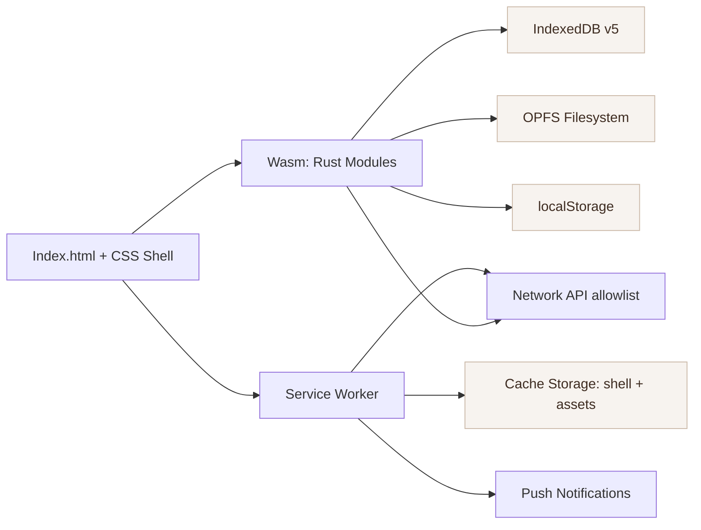

# Offline PWA Audit — iPad mini 6 (A15) • iPadOS 26.2 • Safari 26.2
Date: 2026-02-05
Scope: Current repository state (code + configs). Read-only audit.

## 1) Executive Summary (1 page)

**Overall**: The app is already Rust/Wasm-first with a Service Worker and an offline shell. Structured data lives in IndexedDB (IDB) v5 and binaries live in OPFS (recordings + model files) with IDB blob fallback. There is no SQLite implementation in the current repo. The current PWA implementation is close to the desired “minimal JS” model, but it is **not yet aligned** with the iPadOS Safari constraints around background sync, storage pressure, and OPFS high-performance IO in a dedicated worker. Performance instrumentation is mostly absent at runtime.

**Key findings**
- **No SQLite in repo**: Searches for `sqlite`, `sql.js`, `wa-sqlite`, `sqlite3.wasm`, `rusqlite`, `sqlx` yielded zero results. Current storage is IDB + OPFS. See `rust/storage.rs`, `public/sw.js`.
- **Service Worker**: `public/sw.js` uses cache-first for shell assets and `offline.html` fallback. Update logic exists with `skipWaiting` + a limited integrity check. A `sync` event handler exists but Safari does not support Background Sync, so this path is ineffective on iPadOS.
- **OPFS**: Used for recordings and model files in `rust/storage.rs`, but operations are via async File System Access on the main thread. No `createSyncAccessHandle()` and no dedicated DB worker.
- **Storage pressure**: `navigator.storage.estimate()` and `storage.persist()` are used, but there is no `storage.persisted()` check and no explicit `QuotaExceededError` handling.
- **Install-first UX**: iPadOS-specific install guidance exists; install banners are in Rust (`rust/pwa.rs`).
- **Cross-origin isolation**: COOP/COEP headers are configured in `public/_headers` and `Trunk.toml`.
- **Performance instrumentation**: No runtime `PerformanceObserver` / Event Timing / LCP collection in app code. There are QA scripts and docs, but not live instrumentation in the shipped app.

**Implications for the Rust-first transition**
- The plan is not a “transition from SQLite” but a **migration from IDB to SQLite in OPFS**.
- The biggest near-term risks on iPadOS Safari are **storage eviction**, **lack of Background Sync**, and **OPFS main-thread IO**.
- The transition should prioritize a **dedicated worker with OPFS SyncAccessHandle** for DB IO and a **foreground-only sync model**.

## 2) Architecture Diagram

**File evidence**
- Shell: `index.html`
- Wasm entry: `wasm-init.js`, `rust/lib.rs`
- Storage: `rust/storage.rs`
- Service Worker: `public/sw.js`
- Manifest: `manifest.webmanifest`
- COOP/COEP: `public/_headers`, `Trunk.toml`

## 3) Offline/PWA Behavior Map

### Cold start offline path
1. If SW is active + cache intact:
   - `public/sw.js` serves cache-first shell.
   - `offline.html` used only if cache miss on navigation.
2. If SW missing or cache evicted:
   - Browser loads `offline.html` (if cached) or a generic browser error.
3. App state:
   - Rust loads sessions and other data from IDB on boot (`rust/lib.rs`, `rust/storage.rs`).

### Caching strategy
- **Precache**: `public/sw.js` uses `sw-assets.js` + `public/pwa-manifest.json` + explicit entries.
- **Runtime**: Cache-first for all GET requests; allowlisted network endpoints can be cached.
- **No stale-while-revalidate**: Updates rely on SW update flow.

### Update strategy + UX
- Update banner shown by Rust (`rust/pwa.rs`).
- `SKIP_WAITING` posted to SW; `controllerchange` triggers reload.
- Integrity check compares hashes for `index.html`, `manifest.webmanifest`, `config.json` only; can rollback to previous cache if hash mismatch.

### SW lifecycle risks on iPadOS
- SWs are frequently terminated; long tasks can be cut short.
- Background Sync is not available; `sync` handler in `public/sw.js` will not run on Safari.
- Update can race with DB changes (no coordinated schema/asset handshake).

## 4) Storage Map

| Domain / Entity | Read/Write Frequency | Approx Size & Growth | Consistency Needs | Current Storage | Pain Points / Risks | Proposed Target Storage |
|---|---|---|---|---|---|---|
| Sessions | R/W per session | Small, grows linearly | High (user history) | IDB `sessions` | IDB per-op open cost | SQLite (OPFS) |
| Recordings metadata | R/W per recording | Medium | High | IDB `recordings` | OPFS + IDB duality | SQLite (OPFS) |
| Recording blobs | Large writes | Very large | Medium | OPFS files (+ IDB blob fallback) | Main-thread OPFS IO | OPFS + SQLite metadata |
| Share inbox | Sporadic | Small | Medium | IDB `shareInbox` | SW/IDB duplication | SQLite (OPFS) |
| ML traces | Frequent | Medium growth | Medium | IDB `mlTraces` | No quota handling | SQLite (OPFS) |
| Game scores | Frequent | Small | Medium | IDB `gameScores` | IDB latency | SQLite (OPFS) |
| Score library | Medium | Medium | High | IDB `scoreLibrary` | IDB schema drift | SQLite (OPFS) |
| Assignments | Medium | Small | High | IDB `assignments` | None noted | SQLite (OPFS) |
| Profiles | Medium | Small | High | IDB `profiles` | None noted | SQLite (OPFS) |
| Telemetry queue | Frequent | Small | Low | IDB `telemetryQueue` | Background sync unavailable | SQLite (OPFS) or in-memory + flush |
| Error queue | Frequent | Small | Medium | IDB `errorQueue` | Background sync unavailable | SQLite (OPFS) |
| Score scans | Medium | Medium | Medium | IDB `scoreScans` | None noted | SQLite (OPFS) |
| Model cache metadata | Medium | Medium | Medium | IDB `modelCache` | File/metadata mismatch risk | SQLite (OPFS) |
| Model binaries | Large | Large | Medium | OPFS `/models` | Main-thread IO | OPFS + SQLite metadata |
| Local preferences | Frequent | Small | Low | localStorage | Key sprawl | localStorage or SQLite (if critical) |
| App shell assets | Read-only | Medium+ | Low | Cache Storage | Eviction risk | Cache Storage |

## 5) Safari / iPadOS Constraints Checklist

- Background Sync: **Present in code but ineffective on Safari** (SW `sync` handler exists). Must not rely on it.
- Storage estimate/persist: **Present** (`storage.estimate()` + `storage.persist()`), **missing persisted() check**.
- OPFS feasibility: **Present**, but **no SyncAccessHandle + no worker**.
- Push/badging: **Present** (push subscription + SW push handler + app badge API usage).
- On-device testing plan: **Missing** (no explicit checklist in repo for OPFS/SW/threads on iPadOS 26.2).

## 6) Top 10 Risks
1. **Background Sync dependency**: SW `sync` handler won’t run on Safari.
2. **Storage eviction**: No proactive eviction handling or persisted() checks.
3. **OPFS on main thread**: Large OPFS writes can block UI.
4. **IDB schema drift**: IDB schema duplicated in Rust and SW.
5. **Update + DB mismatch**: SW update not coordinated with DB schema/migration.
6. **Large precache payload**: Cache size may trigger eviction.
7. **Lack of runtime perf telemetry**: No LCP/Event Timing in production.
8. **Manual cache versioning**: Risk of stale cache if CACHE_VERSION not bumped.
9. **Push permission UX**: iOS permission friction; failure mode not surfaced.
10. **No explicit QuotaExceeded handling**: Writes could fail silently.

## 7) Top 10 Opportunities
1. Move structured data to **SQLite in OPFS** with worker-based IO.
2. Centralize DB schema + migrations in Rust (single source of truth).
3. Replace Background Sync with **foreground sync + resume hooks**.
4. Add lightweight perf telemetry (LCP, INP, Event Timing).
5. Reduce cache footprint; split optional assets into on-demand.
6. Implement **migration audit log** for support diagnostics.
7. Use **Navigation API** (if supported) to simplify routing.
8. Exploit Safari 26.2 HTML primitives to reduce JS.
9. Add explicit **storage pressure UX** (warnings + cleanup suggestions).
10. Validate OPFS on device with a dedicated test harness.

## 8) What I Would Change First (Ordered)
1. Remove/disable Background Sync path; move sync to foreground/resume.
2. Add storage pressure detection + persisted() check + user-facing warnings.
3. Build OPFS worker harness using SyncAccessHandle and test on iPad mini 6.
4. Add runtime PerformanceObserver telemetry (LCP, Event Timing, long tasks).
5. Reduce cache size and separate optional assets from core precache.
6. Define SQLite schema + migration plan in Rust, with audit log.
7. Implement DB worker boundary API and batch operations.
8. Coordinate SW update with DB schema version and safe reload.
9. Add structured backup/export to Files for recovery.
10. Remove IDB usage from SW (once SQLite is in place).

## 9) Evidence (Key Files)
- Service Worker: `public/sw.js`
- PWA install + updates + storage estimate: `rust/pwa.rs`
- Storage implementation: `rust/storage.rs`
- OPFS usage: `rust/storage.rs`, `rust/recorder.rs`
- Persistent storage request: `rust/platform.rs`
- Manifest: `manifest.webmanifest`
- COOP/COEP headers: `public/_headers`, `Trunk.toml`
