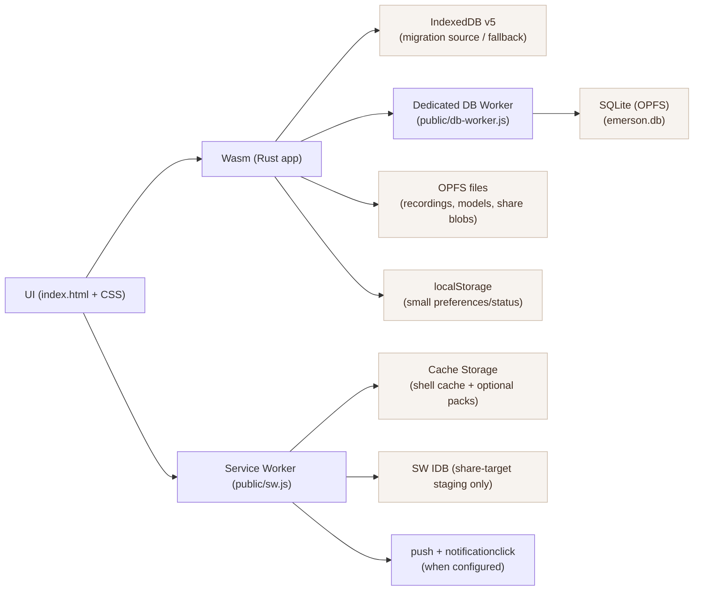

# Offline PWA Audit — iPad mini 6 (A15) · iPadOS 26.2 · Safari 26.2
Date: 2026-02-05  
Scope: Repository state (code + configs) on `codex/audit-rust-transition-ipados`.

## 1) Executive Summary (1 page)

**Current state**: The app is already **Rust/Wasm-first** with a Service Worker and an offline app shell. Structured data is in an **in-progress transition** from **IndexedDB v5** to **SQLite persisted in OPFS**, accessed through a **dedicated DB worker** (`public/db-worker.js` + Rust client). Large binaries (recordings, shared blobs, model files) live in **OPFS files**, with narrow IDB fallback where required. The Service Worker is deliberately minimal and optimized for Safari iPadOS realities (termination, eviction).

**What is already aligned with iPadOS Safari constraints**
- **No Background Sync dependence**: Sync and migrations are foreground-only.
- **Storage quota awareness**: `navigator.storage.estimate()` + persistence UX (`persisted()` + a user-gesture `persist()` button) is present.
- **QuotaExceeded surfacing**: quota-like errors are detected and a user-facing “storage pressure” state is set.
- **OPFS + high-performance IO path exists**: SQLite runs in OPFS via the SQLite OPFS VFS; OPFS test harness exists (main thread + worker).
- **Update safety**: applying SW updates is gated on DB migration verification to avoid “new UI / old schema” footguns.

**Primary gaps / risks (still relevant)**
- **Dual-store complexity**: IDB + SQLite coexist during migration; any missed code path can reintroduce double-writes or drift.
- **Eviction and storage pressure remain real**: persistent storage requests are best-effort on iPadOS; recovery/export must stay first-class.
- **Push reminders are client-wired but require a server**: `/api/push/*` endpoints are configured but not implemented in this repo.
- **On-device validation must be treated as mandatory**: Safari behavior differs from desktop; long-session tests are required.

**What I would do next**
1. Finish cutover hardening: make SQLite the only structured-data truth after verification, and purge IDB (except SW share-target staging).
2. Add explicit on-device stability checks for Wasm threads build and long-running OPFS/SQLite operations.
3. Implement or integrate the push backend contract so reminders are end-to-end real.

## 2) Architecture Overview

**Where truth lives (today)**
- **Structured data**: SQLite in OPFS is the intended truth, but reads/writes are **gated** until migration is verified. During migration the app may still read/write IDB for correctness and rollback.
- **Binary data**: OPFS files (with metadata in SQLite when migrated; IDB blob fallback retained for edge cases).
- **App shell + immutable assets**: Cache Storage.
- **Share-target ingress**: minimal SW-local IDB staging, delivered to the app on next open.

## 3) Offline / PWA Behavior Map

### Cold start offline path
1. If SW is installed and the **boot cache** is present:
   - Navigation requests use a **network-first** strategy with offline fallback (`offline.html`).
   - Static assets (CSS/JS/fonts/audio/sqlite wasm) are served **cache-first** from the boot cache.
2. If the SW is missing or boot cache was evicted:
   - Navigation falls back to Safari’s offline error (best-effort `offline.html` if present).
3. Optional content:
   - PDF assets are **not** in the boot cache. They are fetched from the **pack cache** if the user explicitly cached the PDF pack.

### Caching strategy
- Boot cache: `emerson-violin-shell-v204`
  - Small allowlist of assets required to boot offline.
  - Excludes optional heavy packs (notably `./assets/pdf/*`).
- Pack cache: `emerson-violin-packs-v204`
  - Filled on-demand via SW message `CACHE_PACK` (`pdf` pack is supported).
- `/api/*`: **network-only** in SW (no caching).

### Update strategy + UX
- App checks updates with `ServiceWorkerRegistration.update()` via UI.
- When an update is installed and waiting:
  - The app shows “Update ready. Apply to refresh.”
  - Clicking apply posts `SKIP_WAITING` to the waiting SW and reloads on controller change.
- **Safety gate**: apply/reload is blocked when a DB migration has started but is not verified (prevents mixed versions).

### SW lifecycle risks on iPadOS
- SW work must be bounded: iPadOS may terminate SW mid-task.
- Pack caching is implemented as “best effort”, counting successes without aggressive retries.
- Any long-running work (migration, sync) is kept in the foreground app, not in SW.

## 4) Storage Map (Current vs Target)

| Domain/entity | Read/write frequency | Approx size & growth | Consistency needs | Current storage location(s) | Pain points / risks | Proposed target storage |
|---|---|---|---|---|---|---|
| Sessions | R/W per session | Small, linear | High | IDB `sessions` and/or SQLite `sessions` | Dual-store drift during migration | SQLite (OPFS) |
| Recordings (metadata) | R/W per recording | Medium | High | IDB `recordings` and/or SQLite `recordings` | Metadata/blob mismatch | SQLite (OPFS) |
| Recordings (audio blobs) | Large writes | Very large | Medium | OPFS files (+ narrow IDB fallback) | Eviction/pressure, write failures | OPFS files + SQLite metadata |
| Share inbox items | Sporadic | Small-medium | Medium | App share inbox table + SW staging IDB | Two inboxes (staging vs app) | SQLite `share_inbox` + OPFS blobs; SW IDB staging only |
| ML traces | Frequent | Medium growth | Medium | IDB and/or SQLite `ml_traces` | Growth → quota pressure | SQLite + pruning |
| Game scores | Frequent | Small | Medium | IDB and/or SQLite `game_scores` | None major | SQLite |
| Score library | Medium | Medium | High | IDB and/or SQLite `score_library` | Migration correctness | SQLite |
| Assignments | Medium | Small | High | IDB and/or SQLite `assignments` | Migration correctness | SQLite |
| Profiles | Medium | Small | High | IDB and/or SQLite `profiles` | Migration correctness | SQLite |
| Telemetry queue | Frequent | Small | Low | IDB and/or SQLite `telemetry_queue` | No background sync on Safari | SQLite or memory + flush on foreground |
| Error queue | Frequent | Small | Medium | IDB and/or SQLite `error_queue` | Must survive crashes | SQLite |
| Model cache metadata | Medium | Medium | Medium | IDB and/or SQLite `model_cache` | File/metadata mismatch | SQLite |
| Model binaries | Large | Large | Medium | OPFS `/models` | Pressure/eviction | OPFS + SQLite metadata |
| App shell assets | Read-only | Medium | Low | Cache Storage | Eviction risk | Cache Storage (minimized) |

## 5) Safari/iPadOS Constraints Checklist

- Background Sync: `PASS` (not used for critical workflows).
- Storage estimate: `PASS` (`navigator.storage.estimate()` is used and surfaced).
- Storage persist strategy: `PASS` (`persisted()` shown; `persist()` requested automatically + user-gesture button).
- QuotaExceeded handling: `PASS` (quota-like errors are detected and surfaced).
- OPFS + worker IO: `PASS` (SQLite OPFS worker; OPFS test harness present).
- Share-target staging: `PASS` (minimal SW IDB staging only).
- Push/badging: `PARTIAL` (client + SW handlers exist; backend not in this repo).
- On-device testing plan: `PARTIAL` (test harness exists; checklist/docs must be kept current).

## 6) Top 10 Risks

1. Storage eviction under pressure despite persistence requests.
2. Dual-store drift (IDB vs SQLite) during the migration window.
3. OPFS behavior differences on-device (latency, failure modes, pressure).
4. Safari SW termination during pack caching or share-target delivery.
5. Update timing: serving new UI while migration state is incomplete.
6. QuotaExceeded failures during large binary writes and/or pack caching.
7. Wasm threads instability on iPadOS Safari (threads build).
8. Push permission UX (installed-only behavior, user denial).
9. Long-session memory pressure (jetsam) when handling large blobs.
10. User recovery: export/import must remain robust when storage is damaged.

## 7) Top 10 Opportunities

1. Complete “SQLite as the only structured-data truth” and purge IDB (except SW staging).
2. Tighten SW cache to the smallest viable boot set, with optional packs only.
3. Expand on-device diagnostics exports (storage estimates, DB schema version, migration state).
4. Add an explicit “threads build stability test” harness on-device.
5. Add stronger storage-pressure heuristics (auto cleanup + user guidance).
6. Add explicit pack requirements to the PDF viewer UX (“pack needed for offline PDF”).
7. Reduce boundary crossings with larger DB batches and UI-ready query shapes.
8. Improve migration verification (sampling + checksums per domain).
9. Add durable “migration audit log export” for support.
10. Integrate a push backend and treat reminders as a real feature (not a stub).

## 8) What I Would Change First (Ordered)

1. Finalize migration cutover and remove IDB for primary data (keep SW staging only).
2. Add an explicit on-device “long session” stress checklist (OPFS + SQLite + memory).
3. Ship the push backend contract (public key, subscribe, schedule) or remove the “Push” label from UI until it exists.
4. Make offline pack behavior obvious in UI (pack cached vs not cached, failure reasons).
5. Tighten recovery flows: export snapshot + import validation + clear storage paths.

## 9) Evidence (Key Files)

- Service worker: `public/sw.js`
- SW asset manifest build: `scripts/build/build-sw-assets.js`
- Shell + UX controls: `index.html`
- PWA UX + SW handshake: `rust/pwa.rs`
- Reminders (push client): `rust/reminders.rs`
- SQLite schema + migrations: `rust/db_schema.rs`
- DB worker: `public/db-worker.js`
- DB client + metrics: `rust/db_client.rs`
- Migration gating + reporting: `rust/db_migration.rs`
- Storage + IDB fallback: `rust/storage.rs`
- Quota pressure surfacing: `rust/storage_pressure.rs`
- COOP/COEP headers: `public/_headers`, `Trunk.toml`

